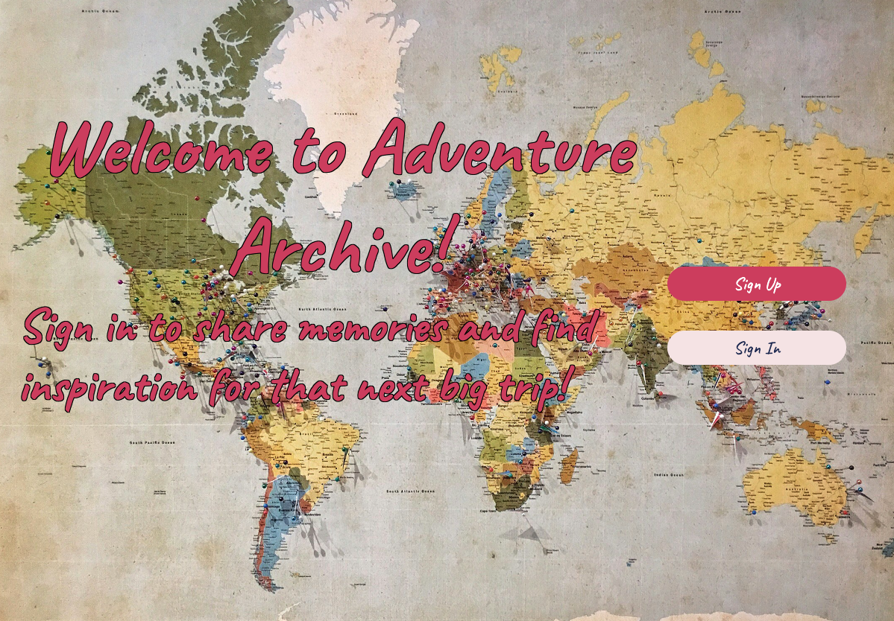

# Adventure Archive
## An app for recording and sharing travel memories

By signing up to this app, users can record details of trips they've been on and can view what others have written in order to find inspiration for their next holiday! 

When travelling we want to travel light; heaps of paper, notebooks and stationary are no longer a convenient way of recording our journeys. With the app; users can update entries as often as they wish, to make sure nothing is forgotten.

Sometimes deciding where to go next is the hardest part of arranging a trip; so hopefully reading others' first-hand accounts can help inspire users looking for their future holiday destinations.

Personally I love travelling and over the years have accumulated countless notepads purchased at airports with disjointed diary entries from trips away. Having all of my memories in one place would be a lot more useful! And there's so many parts of the world to see - being able to read about other people's travels would definitely help me to add some new places to my travel bucket list!

Adventure Archive is a user-friendly web application with full CRUD functionality, built using Embedded JavaScript templates. 

 

**Key Features:**

* **User Authentication:** Users can create accounts and log in ensuring a personalized experience. . Guest users are not able to create, update, or delete data in the application.

* **Responsive Design:** The app is designed to be mobile-friendly, allowing users to access their travel blog from any device, whether it’s a phone, tablet, or desktop.

* **Interactive UI:** EJS templates provide a clean and organized interface, with easy navigation through a navbar and easy to use forms for inputting details of each adventure.

 

**Technologies Used:**
* **EJS:** For rendering dynamic HTML pages.
* **Node.js and Express:** To handle server-side logic and routing.
* **MongoDB:** For storing user and adventure data.
* **JavaScript:** For client-side interactivity and enhancing user experience
* **CSS:** For styling the application, ensuring a visually appealing layout.

 

[**Access Adventure Archive here**](https://zoe-woodward.github.io//)

 

**Planning materials**:
[Find the initial plan here](https://trello.com/b/2bCST3uu/adventure-archive)

 

**Future Developments**

Some potential upgrades for future versions include:

**Active Community Engagement:** Future iterations could include features for users to comment on each other’s adventures or react to others' posts. 

**Abilty to Add Photos:** Being able to add photos to posts along with the text would be useful for keeping memories all in one place and enhance the appearance of the app.

**Ability to share posts with other users:** Simialr to tagging on social media sites, this functionality would be useful for groups/couples to save them all having to write the tip up individually. 

